# Graph Viewer — RenderDoc 扩展

在 qrenderdoc 中新增一个可停靠窗口，把整帧 capture 解析成交互式的 **frame-graph 风格预览窗口**： 用于快速预览每个 pass(graphics/compute pipeline) 与资源(rt/buffer)之间的关系。

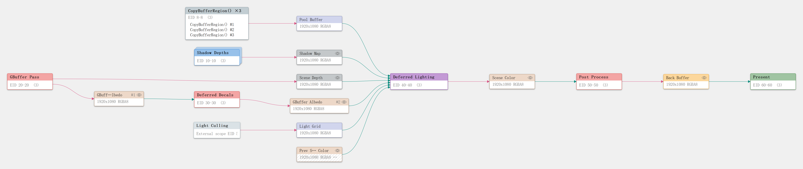

[English](README.md) · **简体中文**

## 节点定义

pass 与资源交替排布，一条边就是一次读或一次写。上面这张图在一个流程里展示了完整的视觉语言，下面的表格是各种类型的节点代表的含义：

| 节点 | 详解 |
|---|---|
| 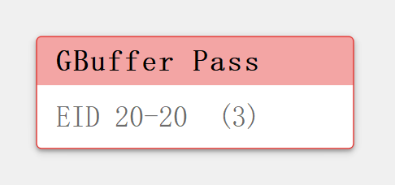 | **Graphics Pass**— 一次或一批光栅化绘制。写颜色 / 深度附件，读它采样的纹理与 buffer，多数帧的主力。 |
| 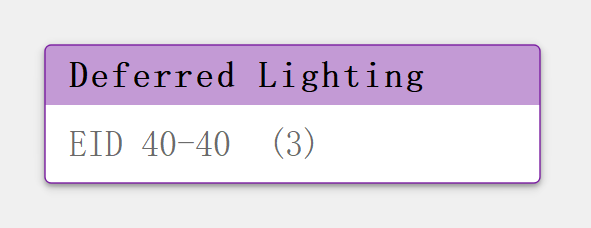 | **Compute Pass**— 一次 compute dispatch。读写 UAV 纹理与 buffer，无固定功能光栅——剔除、光照、粒子模拟、后处理。 |
| 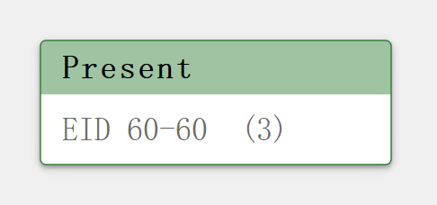 | **Present**— 帧的呈现 / 交换。读最终 swapchain 图像，位于提交顺序最右端。 |
| 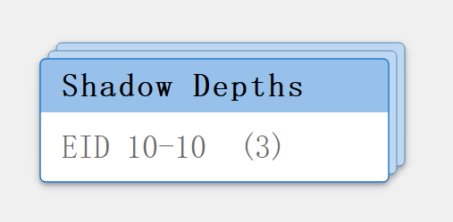 | **Sub-graph**(堆叠卡片)— 以 RenderDoc 中的 debug-marker 区段(相机、渲染阶段……)为单位的聚合节点。用于简化当前的 graph 预览，双击进入 sub-graph 预览。 |
| 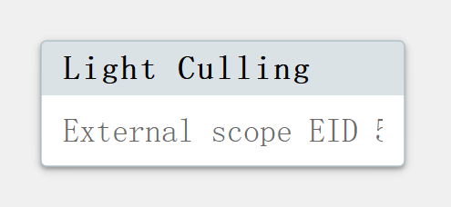 | **传送门**— 代表与当前 sub-graph 有输入输出关联性的外部 sub-graph。让跨 sub-graph 依赖可见。双击跳转。 |
| 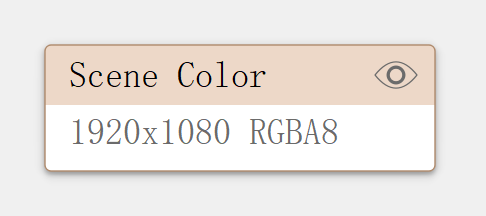 | **Render Target**— 作为颜色附件写入的纹理。点击"眼睛"图标可以快速预览缩略图。 |
| 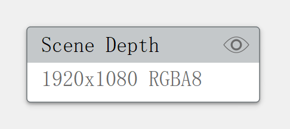 | **Depth Target**— 深度 / 模板缓冲。 |
| 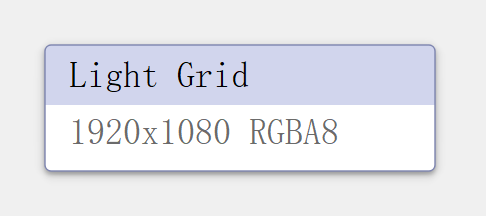 | **Buffer**— 任意 GPU 缓冲(顶点、索引、cbuffer 或 UAV)。 |
| 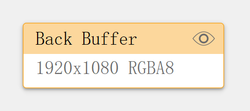 | **Swapchain**— 帧的最终输出。 |
| 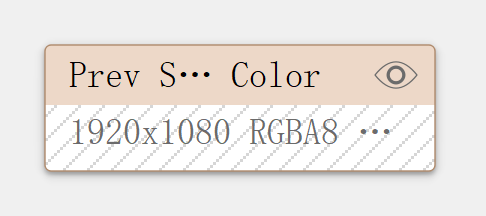 | **外部 / 范围输入** — 内容产生于当前视图之外的节点，会额外带有斜线背景，可能是上一帧历史 RT 或者是 CPU 上传的资源。 |

**连线**按方向着色：**绿** 对应读、**红** 对应写，**虚线**表示绑定到管线但 shader 从未采样。

## 功能

### 写入分身

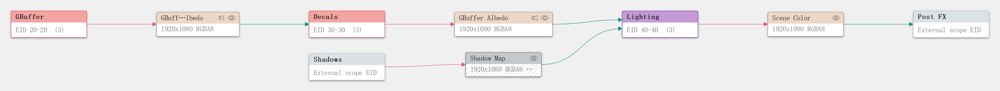

在当前 graph 中被多次写入的资源按"写入阶段"拆分为分身节点，每个写入分身代表当前资源在当前graph中是第几次被写入。选中任一分身时全部兄弟分身同步描边。由此整图连线**严格从左向右**，从而避免 graph 结构过于复杂，并明确同一份资源的多次写入顺序。

### 归并同行为节点

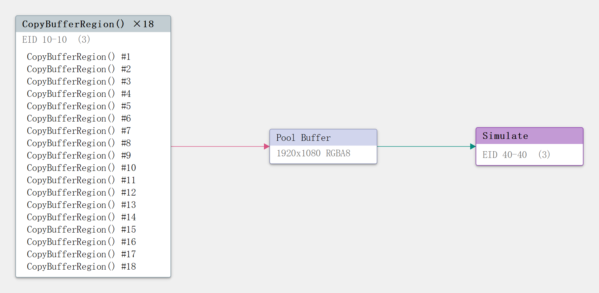

做**同一件事**的节点会归并为一个。归并节点逐行列出全部成员(超 24 项折叠)，**双击某一行直达**。上图中 18 个连续的 `CopyBufferRegion()` 归并为单个 `×18` 节点。

归并算法是启发式的，需同时满足：

1. 边结构完全一致(资源按写入者集合+读取者集合+类别，pass 按读取资源集合+写入资源集合+类别)
2. 名字启发式相似(按分隔符/驼峰/数字边界切词，首尾词元结构一致、数字归一化)
3. 成员数 ≥3、执行序上连续、读写的资源版本相同

### Sub-graph 与传送门

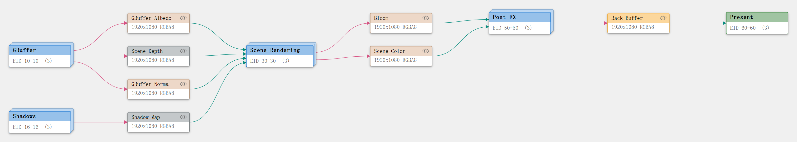

大部分情况下整帧预览的 graph 太大，基本上无法平铺。RenderDoc 把一帧组织成嵌套的 **debug-marker 区段**(相机、阴影 pass、后处理链……)，我们把每个 marker 变成一个 **sub-graph 节点**——一个卡片堆叠的节点，代表该 marker 内部提交的全部内容，从而提升 graph 的可读性。

双击一个 **sub-graph** 节点把它打开以预览该 marker **内部**的 pass 与资源。

双击上图的 **Scene Rendering** 进去，可以看到内部的 pass 结构，以及 Scene Rendering 接受的输入会以外部节点的形式表现在 sub-graph 内部：

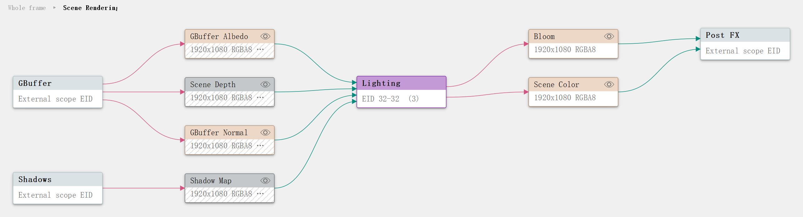

其中，带有相关性的外部 sub-graph 会以**传送门**的形式展示在 sub-graph 中，比如上游的 GBuffer、Shadows，以及下游的 Post FX。

双击传送门即可跳到它代表的外部。例如双击上图的 Post FX 消费者传送门，就会落到 Post FX sub-graph 里，而你刚离开的 sub-graph 此时变成喂入它的生产者传送门：

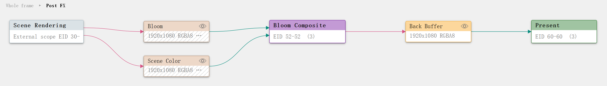

切换显示选项、归并、预览时保留当前平移与缩放，只有返回/刷新才重新适配。

### 深度读写精化(按 API 适配)

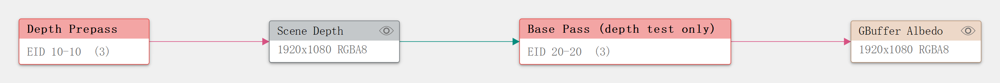

不同 API 分别适配了获取 Depth Buffer 在当前 graphics pipeline 中的读写状态，根据管线的 Depth Test 状态来区分读、写还是既读又写。

### 检测未使用绑定

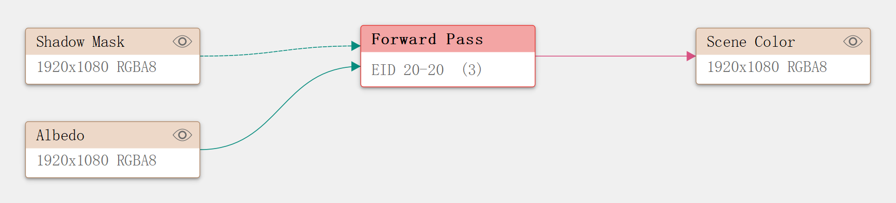

可选的描述符使用分析，把"绑定到管线但 shader 从未引用"的读边画成虚线——让无效绑定一眼可见。在配置面板里开关。这个功能一般不会命中，如果命中了可以确认一下是否有多余的不需要的资源绑定。

### 配置面板

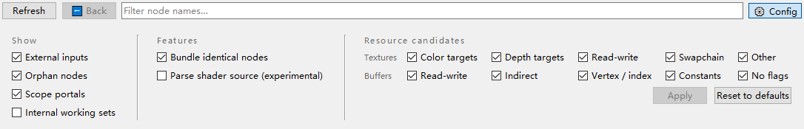

配置条从工具栏下拉。所有开关都批量走 Apply——点击前不会动图。状态持久化到 `%APPDATA%\qrenderdoc\renderdoc_graph_viewer.json`。

## 安装和使用

要求**官方构建的 RenderDoc ≥ 1.33**(需要其捆绑的 PySide2)。

1. 把 `renderdoc_graph_viewer` 文件夹复制到 `%APPDATA%\qrenderdoc\extensions`，最终形成 `…\qrenderdoc\extensions\renderdoc_graph_viewer\extension.json`。

2. 在 RenderDoc 中：**Tools → Manage Extensions → 勾选 "renderdoc-graph-viewer"**(可同时勾选 Always Load)。

加载 capture 后：**Window → Graph Viewer**，窗口打开时自动解析。

## 已测试的图形 API

解析与图形后端无关，已测试：

| API | 状态 |
|---|---|
| Direct3D 12 | ✅ 已测试 |
| Direct3D 11 | ✅ 已测试 |
| Vulkan | ✅ 已测试 |
| OpenGL | ⚠️ 未测试 |

## 已知限制

- 依赖关系为**纹理/缓冲整体级**，不区分 subresource(mip/slice)。
- 绑定到描述符但实际未采样的资源也会产生读边(与 `GetUsage` 口径一致);但是添加了未使用绑定画成虚线功能。
- 缩略图只能预览正常纹理，特定格式可能失效。

## License

[MIT](LICENSE)
